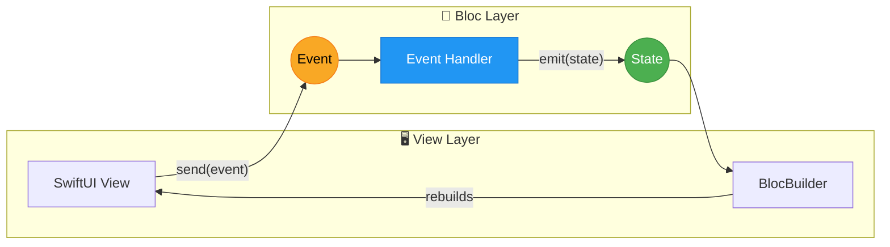
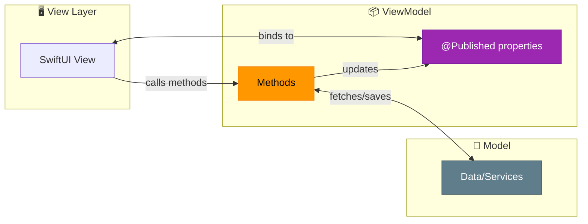
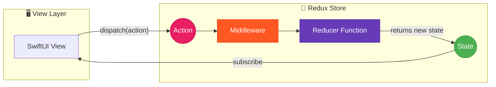
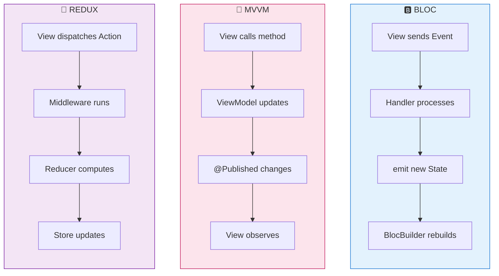
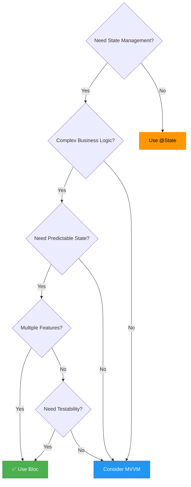

# Bloc

[](https://swift.org)
[](https://developer.apple.com/ios/)
[](https://developer.apple.com/macos/)
[](https://opensource.org/licenses/MIT)

A Swift implementation of the [Bloc pattern](https://bloclibrary.dev/) for building applications in a consistent and understandable way, with composition, testing, and ergonomics in mind.

* [What is Bloc?](#what-is-bloc)
* [Architecture Comparison](#architecture-comparison)
* [Getting Started](#getting-started)
* [Core Concepts](#core-concepts)
* [Basic Usage](#basic-usage)
  * [Handling Events with Associated Values](#handling-events-with-associated-values)
  * [Async Operations](#async-operations)
  * [Combine Integration](#combine-integration)
  * [Error Handling](#error-handling)
* [Advanced Features](#advanced-features)
  * [BlocObserver](#blocobserver)
  * [Lifecycle Hooks](#lifecycle-hooks)
  * [Lifecycle Management (close)](#lifecycle-management-close)
  * [HydratedBloc — State Persistence](#hydratedbloc--state-persistence)
  * [BlocListener](#bloclistener)
  * [buildWhen / listenWhen](#buildwhen--listenwhen)
  * [Event Transformers](#event-transformers)
* [Examples](#examples)
* [Documentation](#documentation)
* [Installation](#installation)
* [Requirements](#requirements)
* [License](#license)

## What is Bloc?

**Bloc** (Business Logic Component) is a predictable state management pattern that helps separate presentation from business logic, making your code easier to test, maintain, and reason about.

The pattern is built around three core principles:

1. **Unidirectional Data Flow**: Events flow in → State flows out
2. **Single Source of Truth**: The Bloc holds the authoritative state
3. **Predictable State Changes**: State can only change in response to events

```
┌─────────────────────────────────────────────────────────┐
│                         View                            │
│                                                         │
│   ┌─────────────┐                    ┌──────────────┐   │
│   │   Button    │────send(event)────▶│  bloc.state  │   │
│   └─────────────┘                    └──────────────┘   │
│                                             ▲           │
└─────────────────────────────────────────────│───────────┘
                                              │
┌─────────────────────────────────────────────│───────────┐
│                        Bloc                 │           │
│                                             │           │
│   ┌─────────────┐    ┌──────────────┐    ┌──┴───────┐   │
│   │    Event    │───▶│   Handler    │───▶│  emit()  │   │
│   └─────────────┘    └──────────────┘    └──────────┘   │
│                                                         │
└─────────────────────────────────────────────────────────┘
```

## Architecture Comparison

Understanding how Bloc differs from other state management patterns helps you choose the right approach. Here's a visual comparison:

### Bloc Pattern



**Key Characteristics:**
- **Unidirectional flow**: Events → Handler → State → View
- **Event-driven**: All state changes happen through explicit events
- **Type-safe handlers**: Each event type has its own handler
- **Reactive updates**: State changes automatically trigger view rebuilds

### MVVM Pattern



**Key Characteristics:**
- **Bidirectional binding**: View and ViewModel communicate directly
- **Method-based**: Actions are direct method calls
- **Property-driven**: State is exposed via `@Published` properties
- **Flexible**: Less structure, more freedom (and potential chaos)

### Redux Pattern



**Key Characteristics:**
- **Single store**: One global state tree for the entire app
- **Pure reducers**: State transitions are pure functions `(State, Action) -> State`
- **Middleware**: Side effects handled through middleware chain
- **Immutable state**: State is never mutated, always replaced

### Side-by-Side Comparison



### Key Differences

| Aspect | Bloc | MVVM | Redux |
|--------|------|------|-------|
| **State Changes** | Via explicit events | Direct property mutation | Via dispatched actions |
| **State Location** | Per-feature Bloc | Per-view ViewModel | Single global store |
| **Side Effects** | Inside event handlers | Inside ViewModel methods | Via middleware |
| **Testability** | ✅ Excellent (event → state) | ⚠️ Moderate (mocking) | ✅ Excellent (pure reducers) |
| **Boilerplate** | Medium | Low | High |
| **Learning Curve** | Medium | Low | High |
| **Scalability** | ✅ Great (isolated blocs) | ⚠️ Can get messy | ✅ Great (predictable) |
| **Debugging** | ✅ Event trace | ⚠️ Property observation | ✅ Action log + time travel |
| **SwiftUI Fit** | ✅ Natural | ✅ Native | ⚠️ Requires adaptation |

### When to Choose Bloc



**Choose Bloc when you need:**
- 🎯 **Predictable state management** with clear event → state mapping
- 🧪 **High testability** for business logic
- 📦 **Feature isolation** with independent blocs
- 🔍 **Debuggability** with traceable event streams
- 🏗️ **Scalable architecture** for growing teams and codebases

**Choose MVVM when:**
- Building simple screens with minimal business logic
- Rapid prototyping is needed
- Team is already familiar with MVVM patterns

**Choose Redux when:**
- You need time-travel debugging
- Global state coordination across the entire app is critical
- Coming from a React/Redux background

## Getting Started

### A Simple Counter

Let's build a counter to demonstrate the core concepts.

**1. Define your Events**

Events represent user actions or occurrences that can trigger state changes:

```swift
enum CounterEvent: Hashable {
    case increment
    case decrement
    case reset
}
```

**2. Create your Bloc**

The Bloc contains your business logic and manages state transitions:

```swift
import Bloc

@MainActor
class CounterBloc: Bloc<Int, CounterEvent> {
    
    init() {
        super.init(initialState: 0)
        
        on(.increment) { [weak self] event, emit in
            guard let self else { return }
            emit(self.state + 1)
        }
        
        on(.decrement) { [weak self] event, emit in
            guard let self else { return }
            emit(self.state - 1)
        }
        
        on(.reset) { event, emit in
            emit(0)
        }
    }
}
```

**3. Provide the Bloc**

Wrap your view hierarchy with `BlocProvider` to make Blocs available:

```swift
import SwiftUI
import Bloc

@main
struct MyApp: App {
    var body: some Scene {
        WindowGroup {
            BlocProvider(with: [
                CounterBloc()
            ]) {
                ContentView()
            }
        }
    }
}
```

**4. Use in your View**

Access the Bloc and its state directly—SwiftUI automatically observes changes:

```swift
struct CounterView: View {
    let counterBloc = BlocRegistry.resolve(CounterBloc.self)
    
    var body: some View {
        VStack(spacing: 20) {
            Text("Count: \(counterBloc.state)")
                .font(.largeTitle)
            
            HStack(spacing: 40) {
                Button("−") { counterBloc.send(.decrement) }
                Button("+") { counterBloc.send(.increment) }
            }
            .font(.title)
            
            Button("Reset") { counterBloc.send(.reset) }
        }
    }
}
```

That's it! No `@State` mirroring, no `.onReceive`—just direct state access with automatic SwiftUI updates.

## Core Concepts

### State

State represents the data your UI needs to render. States must conform to `Equatable`:

```swift
// Simple state (using a primitive type)
class CounterBloc: Bloc<Int, CounterEvent> { ... }

// Complex state (using a custom type)
struct LoginState: Equatable {
    var email: String = ""
    var password: String = ""
    var isLoading: Bool = false
    var error: String?
}

class LoginBloc: Bloc<LoginState, LoginEvent> { ... }
```

### Events

Events are inputs to a Bloc—they trigger state changes. Events must conform to `Equatable & Hashable`:

```swift
// Simple enum events
enum CounterEvent: Hashable {
    case increment
    case decrement
}

// Events with associated values
enum LoginEvent: Hashable {
    case emailChanged(String)
    case passwordChanged(String)
    case loginButtonTapped
    case loginSucceeded(User)
    case loginFailed(String)
}
```

### Bloc

The Bloc is where your business logic lives. It receives events and emits new states:

```swift
@MainActor
class LoginBloc: Bloc<LoginState, LoginEvent> {
    private let authService: AuthService
    
    init(authService: AuthService) {
        self.authService = authService
        super.init(initialState: LoginState())
        
        on(.emailChanged) { [weak self] event, emit in
            guard let self, case .emailChanged(let email) = event else { return }
            var newState = self.state
            newState.email = email
            emit(newState)
        }
        
        on(.loginButtonTapped) { [weak self] event, emit in
            guard let self else { return }
            var newState = self.state
            newState.isLoading = true
            emit(newState)
            
            Task {
                await self.performLogin()
            }
        }
    }
    
    private func performLogin() async {
        do {
            let user = try await authService.login(
                email: state.email,
                password: state.password
            )
            send(.loginSucceeded(user))
        } catch {
            send(.loginFailed(error.localizedDescription))
        }
    }
}
```

### BlocProvider

`BlocProvider` registers Blocs and makes them available throughout your view hierarchy:

```swift
BlocProvider(with: [
    CounterBloc(),
    LoginBloc(authService: LiveAuthService()),
    SettingsBloc()
]) {
    MainTabView()
}
```

### BlocRegistry

`BlocRegistry` provides type-safe access to registered Blocs:

```swift
// In any view within the BlocProvider hierarchy
let counterBloc = BlocRegistry.resolve(CounterBloc.self)
let loginBloc = BlocRegistry.resolve(LoginBloc.self)
```

If you try to resolve a Bloc that hasn't been registered, you'll get a helpful error message:

```
Bloc of type 'SettingsBloc' has not been registered.

Currently registered Blocs: [CounterBloc, LoginBloc]

Make sure to register it in your BlocProvider:

    BlocProvider(with: [
        SettingsBloc(initialState: ...),
        // ... other blocs
    ]) {
        YourContentView()
    }
```

## Basic Usage

### Handling Events with Associated Values

For events with associated values, use `mapEventToState`:

```swift
@MainActor
class SearchBloc: Bloc<SearchState, SearchEvent> {
    
    init() {
        super.init(initialState: SearchState())
        
        // Simple events can use `on(_:handler:)`
        on(.clearResults) { event, emit in
            emit(SearchState())
        }
    }
    
    // Events with associated values use `mapEventToState`
    override func mapEventToState(event: SearchEvent, emit: @escaping Emitter) {
        switch event {
        case .queryChanged(let query):
            var newState = state
            newState.query = query
            emit(newState)
            
        case .search:
            emit(SearchState(query: state.query, isLoading: true))
            Task { await performSearch() }
            
        case .resultsLoaded(let results):
            emit(SearchState(query: state.query, results: results))
            
        case .clearResults:
            break // Handled by `on(_:handler:)`
        }
    }
}
```

### Async Operations

Handle async operations by emitting loading states and using `Task`:

```swift
on(.fetchData) { [weak self] event, emit in
    guard let self else { return }
    
    // Emit loading state
    emit(.loading)
    
    // Perform async work
    Task {
        do {
            let data = try await self.api.fetchData()
            self.emit(.loaded(data))
        } catch {
            self.emit(.error(error.localizedDescription))
        }
    }
}
```

### Combine Integration

Three publishers are available for reactive pipelines:

```swift
// Observe every state change
counterBloc.statePublisher
    .removeDuplicates()
    .sink { state in print("State: \(state)") }
    .store(in: &cancellables)

// Observe every dispatched event
counterBloc.eventsPublisher
    .sink { event in print("Event: \(event)") }
    .store(in: &cancellables)

// Observe errors signalled via addError(_:)
counterBloc.errorsPublisher
    .sink { error in print("Error: \(error)") }
    .store(in: &cancellables)
```

`eventsPublisher` uses a `PassthroughSubject` internally and emits each event after it has been dispatched, in the order received.

### Error Handling

Use `addError(_:)` to surface errors without encoding them into the state type. This keeps your state model clean and lets error handling be composed separately:

```swift
on(.fetchData) { [weak self] event, emit in
    guard let self else { return }
    do {
        let data = try await api.fetchData()
        emit(.loaded(data))
    } catch {
        addError(error)   // broadcasts to errorsPublisher
        emit(.idle)       // state resets without carrying the error
    }
}
```

Observe errors centrally—for example to feed a crash reporter or a toast notification system:

```swift
bloc.errorsPublisher
    .sink { error in
        CrashReporter.log(error)
        ToastManager.show(error.localizedDescription)
    }
    .store(in: &cancellables)
```

You can use the built-in ``BlocError`` type for generic cases, or your own `Error` conforming type for domain-specific errors:

```swift
enum DataError: Error {
    case networkUnavailable
    case invalidResponse(statusCode: Int)
}

// Inside a handler:
addError(DataError.networkUnavailable)
```

## Advanced Features

### BlocObserver

`BlocObserver` is a global observer that receives lifecycle notifications from **every** Bloc in the app. It is the recommended way to implement cross-cutting concerns — logging, analytics, crash reporting — without touching individual Bloc subclasses.

#### Setting the observer

Set it once at app startup, before any Blocs are created:

```swift
@main
struct MyApp: App {
    init() {
        BlocObserver.shared = AppBlocObserver()
    }
}
```

#### Implementing a custom observer

Subclass `BlocObserver` and override the hooks you need. Always call `super`:

```swift
class AppBlocObserver: BlocObserver {

    override func onCreate(_ bloc: any BlocBase) {
        super.onCreate(bloc)
        print("Created: \(type(of: bloc))")
    }

    override func onEvent(_ bloc: any BlocBase, event: Any) {
        super.onEvent(bloc, event: event)
        print("\(type(of: bloc)) ← \(event)")
    }

    override func onChange(_ bloc: any BlocBase, change: Any) {
        super.onChange(bloc, change: change)
        print("\(type(of: bloc)) \(change)")
    }

    override func onTransition(_ bloc: any BlocBase, transition: Any) {
        super.onTransition(bloc, transition: transition)
        print("\(type(of: bloc)) \(transition)")
    }

    override func onError(_ bloc: any BlocBase, error: Error) {
        super.onError(bloc, error: error)
        CrashReporter.log(error)
    }
}
```

With this in place, every existing and future Bloc — `CounterBloc`, `LoginBloc`, anything new — is automatically observed. No per-Bloc logging code needed.

#### Observer hooks

| Hook | When it fires | Parameters |
|------|---------------|------------|
| `onCreate` | Bloc is initialised | `bloc` |
| `onEvent` | Before an event is dispatched | `bloc`, `event: Any` |
| `onChange` | After every `emit()` | `bloc`, `change: Any` (cast to `Change<S>`) |
| `onTransition` | After sync `emit()` with event context | `bloc`, `transition: Any` (cast to `Transition<E,S>`) |
| `onError` | When `addError()` is called | `bloc`, `error: Error` |

#### Redacting sensitive event data

When an event carries sensitive values such as passwords, conform the event to `CustomStringConvertible` so that `String(describing:)` — used by the observer — emits a safe representation:

```swift
extension LoginEvent: CustomStringConvertible {
    var description: String {
        switch self {
        case .login(let email, _):
            return "login(email: \"\(email)\", password: [REDACTED])"
        default:
            return "\(self)"
        }
    }
}
```

### Lifecycle Hooks

Every `Bloc` exposes four overridable lifecycle methods that let you observe its internal activity without modifying the state or handler logic. They are the foundation for features like `BlocObserver`, `HydratedBloc`, and per-bloc logging.

```
Event sent
    │
    ▼
onEvent(_:)          ← called before processing begins
    │
    ▼
Handler / mapEventToState
    │
    ▼
emit(_:) called
    │
    ├──▶ onTransition(_:)   ← includes the triggering event (sync only)
    └──▶ onChange(_:)       ← always fired, sync or async
```

#### `onEvent(_:)`

Called immediately before an event is dispatched to its handler.

```swift
override func onEvent(_ event: CounterEvent) {
    super.onEvent(event)
    print("Processing: \(event)")
}
```

#### `onChange(_:)`

Called after every `emit(_:)`, synchronous or async, with a `Change` value containing the previous and next states.

```swift
override func onChange(_ change: Change<Int>) {
    super.onChange(change)
    print(change)
    // Change { currentState: 0, nextState: 1 }
}
```

#### `onTransition(_:)`

A superset of `onChange` that also carries the event. Only fires when `emit` is called synchronously within an event handler — emissions from `Task` blocks reach `onChange` but not `onTransition`.

```swift
override func onTransition(_ transition: Transition<CounterEvent, Int>) {
    super.onTransition(transition)
    print(transition)
    // Transition { currentState: 0, event: increment, nextState: 1 }
}
```

#### `onError(_:)`

Called whenever `addError(_:)` is invoked, giving you a central place to log or react to Bloc-level errors.

```swift
override func onError(_ error: Error) {
    super.onError(error)
    CrashReporter.log(error)
}
```

#### Always call `super`

Each hook calls `super` to ensure the chain is preserved as the library grows (e.g. `BlocObserver` wiring, coming in a later release, is inserted at the `super` call site).

#### Calculator Example

The **Calculator** example in `Examples/Calculator/` demonstrates all four hooks live. As you operate the calculator, the right-hand panel displays a colour-coded log of every hook invocation in real time:

| Badge | Hook | When it fires |
|-------|------|---------------|
| `EVENT` (green) | `onEvent` | Every button tap |
| `TRANSITION` (purple) | `onTransition` | Synchronous state change with event context |
| `CHANGE` (cyan) | `onChange` | Every `emit()` call |
| `ERROR` (red) | `onError` | Division by zero via `addError()` |

```swift
@MainActor
class CalculatorBloc: Bloc<CalculatorState, CalculatorEvent> {

    let lifecycleLog = BlocLifecycleLog()

    override func onEvent(_ event: CalculatorEvent) {
        super.onEvent(event)
        lifecycleLog.append(kind: .event, message: "\(event)")
    }

    override func onChange(_ change: Change<CalculatorState>) {
        super.onChange(change)
        lifecycleLog.append(
            kind: .change,
            message: "\(change.currentState.displayValue) → \(change.nextState.displayValue)"
        )
    }

    override func onTransition(_ transition: Transition<CalculatorEvent, CalculatorState>) {
        super.onTransition(transition)
        lifecycleLog.append(
            kind: .transition,
            message: "\(transition.currentState.displayValue) — \(transition.event) → \(transition.nextState.displayValue)"
        )
    }

    override func onError(_ error: Error) {
        super.onError(error)
        lifecycleLog.append(kind: .error, message: error.localizedDescription ?? "\(error)")
    }
}
```

> The `BlocLifecycleLog` is a simple `@Observable` class that the view observes directly — it is not part of the Bloc state. This keeps logging concerns separate from business logic.

---

## Lifecycle Management (close)

Every `Bloc` must be closed when it is no longer needed. Closing a Bloc:

- Cancels all active Combine subscriptions.
- Completes `eventsPublisher`, `errorsPublisher`, and `statePublisher` (sends `.finished`).
- Sets `isClosed = true`, turning `send()` and `emit()` into no-ops.
- Fires `onClose()` on the Bloc itself, then `BlocObserver.shared.onClose(_:)`.

### Calling `close()` explicitly

```swift
// When a screen is dismissed, close its Bloc
.onDisappear {
    BlocRegistry.resolve(SearchBloc.self).close()
}
```

### Automatic cleanup via `BlocProvider`

`BlocProvider` registers its Blocs with `BlocRegistry`. When the active registry is deallocated (app termination, or a scoped provider leaving the view tree) it calls `close()` on all registered Blocs automatically — no manual teardown required for app-level Blocs.

### Detecting the closed state

`isClosed` is a publicly readable, `@Observable` property on every `Bloc`. SwiftUI views that read it will update automatically:

```swift
struct MyView: View {
    let bloc = BlocRegistry.resolve(MyBloc.self)

    var body: some View {
        if bloc.isClosed {
            Text("Bloc has been closed")
        } else {
            // normal UI
        }
    }
}
```

### Reacting to close in a Bloc subclass

Override `onClose()` to perform custom teardown (flush a cache, write pending data, etc.). Always call `super` so `BlocObserver.onClose` fires:

```swift
class SearchBloc: Bloc<SearchState, SearchEvent> {

    override func onClose() {
        super.onClose()          // fires BlocObserver.shared.onClose(self)
        cache.flush()
        print("\(type(of: self)) closed")
    }
}
```

### Reacting to close in `BlocObserver`

`BlocObserver.onClose` gives a single place to log teardown across every Bloc in the app:

```swift
class AppBlocObserver: BlocObserver {

    override func onClose(_ bloc: any BlocBase) {
        super.onClose(bloc)
        Analytics.track("bloc_closed", properties: ["bloc": "\(type(of: bloc))"])
    }
}
```

### App-level vs scoped Blocs

| Scope | Registration | When `close()` fires |
|---|---|---|
| App-level | `BlocProvider` at root | On app termination (automatic via `BlocRegistry.deinit`) |
| Screen-scoped | Created per-screen | Call manually in `.onDisappear`, or use a scoped `BlocProvider` |

> **Demo:** Open the **Calculator** example and tap the ⏹ button in the lifecycle log panel. This simulates closing a screen-scoped Bloc — you'll see the `CLOSE` event in the log, the calculator becomes non-interactive, and `BlocObserver.onClose` fires (visible in Pulse).

---

## HydratedBloc — State Persistence

`HydratedBloc` is a `Bloc` subclass that automatically saves its state to `UserDefaults` (or any custom ``HydratedStorage`` backend) on every `emit`, and restores it the next time the Bloc is created.

### Requirements

The state type must conform to both `BlocState` and `Codable`:

```swift
struct SettingsState: BlocState, Codable {
    var darkMode: Bool = false
    var fontSize: Int = 16
}
```

`Int`, `String`, `Bool`, and other standard library types are `Codable` out of the box, so simple counters need no extra work.

### Creating a HydratedBloc

```swift
class CounterBloc: HydratedBloc<Int, CounterEvent> {
    init() {
        super.init(initialState: 0)  // rehydrates from UserDefaults if available

        on(.increment) { [weak self] _, emit in
            guard let self else { return }
            emit(state + 1)           // automatically persisted
        }
        on(.decrement) { [weak self] _, emit in
            guard let self else { return }
            emit(state - 1)
        }
    }
}
```

That's all. The count survives app restarts with no additional code.

### Rehydration is creation-time only

State is read from storage **once**, when the Bloc is initialised. There is no way to "re-pull" persisted data into a running Bloc mid-session — you have two options instead:

| Method | Storage | In-memory state | Use case |
|---|---|---|---|
| `clearStoredState()` | Deleted | Unchanged | Wipe storage; effect visible next launch |
| `resetToInitialState()` | Deleted then re-written with `initialState` | Set to `initialState` immediately | Instant reset without restarting |

```swift
// "Log out" — wipe storage only; user's current session is unaffected
userBloc.clearStoredState()

// "Reset" button — wipe storage AND reset the UI immediately
counterBloc.resetToInitialState()
```

### Custom storage key

By default the key is the class name (`"CounterBloc"`). Override `storageKey` to use a stable, version-safe key:

```swift
class SettingsBloc: HydratedBloc<SettingsState, SettingsEvent> {
    override class var storageKey: String { "settings_v2" }
}
```

### Custom storage backend

Inject any ``HydratedStorage`` conformer — useful for testing with an in-memory store:

```swift
final class InMemoryStorage: HydratedStorage {
    private var store: [String: Data] = [:]
    func read(key: String) -> Data? { store[key] }
    func write(key: String, value: Data) { store[key] = value }
    func delete(key: String) { store[key] = nil }
    func clear() { store.removeAll() }
}

// In tests
let bloc = CounterBloc(storage: InMemoryStorage())
```

### Clearing all hydrated blocs

`BlocRegistry.resetAllHydratedBlocs()` iterates every registered Bloc, resets those that conform to `AnyHydratedBloc`, and clears all `UserDefaults` keys in one call:

```swift
// Settings screen / debug button
BlocRegistry.resetAllHydratedBlocs()
```

> **Demo:** Open the **Counter** example. The current value is persisted — quit and relaunch the app to see rehydration. Use the **"Clear Stored State + Reset"** button to wipe storage and reset the counter immediately. The **"Clear Hydrated Storage"** button in the sidebar footer resets all registered `HydratedBloc`s at once.

---

---

## BlocListener

`BlocListener` is a view that subscribes to a Bloc's state stream and calls a `listener` closure for side effects — without ever causing its content to rebuild.

Use it whenever a state change should trigger something outside the UI tree: navigation, a toast notification, a sound effect, an analytics event, or any other imperative action.

### When to use BlocListener vs BlocBuilder

| Need | Use |
|------|-----|
| Re-render UI when state changes | ``BlocBuilder`` (or direct `@Observable` access) |
| Run a side effect when state changes | `BlocListener` |
| Both side effects **and** UI rebuilds | Nest `BlocBuilder` inside `BlocListener`'s `content` |

### Basic usage

```swift
// Show a toast whenever an item is added to the cart
BlocListener(CartBloc.self) { state in
    ToastManager.show("Item added! Cart total: \(state.itemCount)")
} content: {
    CartView()
}
```

The `listener` closure receives the new state and runs on the main thread. The `content` view hierarchy is **never** re-executed by `BlocListener` itself.

### Using `listenWhen`

Add a `listenWhen` predicate to fire the listener only for specific transitions.
It receives `(previous, current)` and must return `true` to invoke the listener:

```swift
// Navigate home only when login succeeds
BlocListener(AuthBloc.self,
    listenWhen: { prev, current in
        !prev.isAuthenticated && current.isAuthenticated
    }
) { state in
    navigator.push(.home)
} content: {
    LoginForm()
}
```

When `listenWhen` is omitted the listener is called on **every** state change.

### Side-effect pattern: overlay banner

A common pattern is updating a local `@State` variable inside `listener` to show
an overlay without rebuilding any of the Bloc-driven content:

```swift
@State private var milestone: String? = nil

BlocListener(ScoreBloc.self,
    listenWhen: { _, new in new > 0 && new % 5 == 0 }
) { state in
    milestone = "🎯 \(state) points!"
    Task { @MainActor in
        try? await Task.sleep(for: .seconds(2))
        milestone = nil
    }
} content: {
    ScoreContentView()
}
.overlay(alignment: .top) {
    if let text = milestone {
        MilestoneBanner(text: text)
            .transition(.move(edge: .top).combined(with: .opacity))
    }
}
```

> **Demo:** Open the **Score Board** example. Tap **Score!** to increment. Every 5 points a milestone banner slides in from the top — fired by `BlocListener`. The banner appears without any rebuild of the score counter or tier badge.

---

## buildWhen / listenWhen

Both `BlocBuilder` and `BlocListener` accept an optional predicate that gives you
fine-grained control over when they respond to state changes.

### `buildWhen` in BlocBuilder

By default `BlocBuilder` passes the live Bloc to its content closure, and
SwiftUI's `@Observable` system rebuilds the view whenever the state changes.

When you add `buildWhen`, the content closure receives a **state snapshot**
instead of the live Bloc. The snapshot is only updated — and the content only
redrawn — when `buildWhen` returns `true`:

```swift
// Only rebuilds when the player crosses a tier boundary (every 10 pts).
// The 9 intermediate point increments are intentionally ignored.
BlocBuilder(ScoreBloc.self,
    buildWhen: { old, new in old / 10 != new / 10 }
) { state in
    TierBadge(name: tierName(for: state))  // state is B.State, not B
}
```

The content closure signature changes from `(B) -> Content` to
`(B.State) -> Content` so that `@Observable` auto-tracking cannot bypass the
filter.

#### When to use `buildWhen`

- A large state struct has many fields but a particular section only cares
  about one.
- You want a subsection to update at discrete thresholds, not on every emit.
- For even stricter derived-value control (e.g. `\.isLoading`), see
  `BlocSelector` (coming soon).

### `listenWhen` in BlocListener

`listenWhen` works the same way for side effects: the `listener` is called only
when the predicate returns `true`. The internal cursor always advances to the
latest emitted state, so missed states are not replayed:

```swift
BlocListener(AuthBloc.self,
    listenWhen: { prev, current in
        prev.isAuthenticated != current.isAuthenticated
    }
) { state in
    state.isAuthenticated ? navigator.push(.home) : navigator.pop(to: .login)
} content: {
    AuthContent()
}
```

### Combining both predicates

Nest `BlocBuilder` inside `BlocListener` to apply independent filters to each
layer:

```swift
// Side effect fires only on error transitions
BlocListener(DataBloc.self,
    listenWhen: { prev, curr in prev.error == nil && curr.error != nil }
) { state in
    ToastManager.showError(state.error!.localizedDescription)
} content: {
    // UI only rebuilds when loading status changes
    BlocBuilder(DataBloc.self,
        buildWhen: { old, new in old.isLoading != new.isLoading }
    ) { state in
        state.isLoading ? ProgressView() : DataList()
    }
}
```

> **Demo:** Open the **Score Board** example. Use Xcode's Debug → View Hierarchy or add a print statement inside the tier `BlocBuilder` content closure to confirm it only fires at 10, 20, and 30 points while the score counter updates on every tap.

---

## Event Transformers

Event Transformers give you fine-grained control over how events are processed when a new
event of the same type arrives while a previous handler invocation is still active or pending.

Attach a transformer when registering a handler:

```swift
on(.search, transformer: .debounce(.milliseconds(300))) { event, emit in
    Task { await performSearch(emit: emit) }
}
```

### Available transformers

| Transformer | Behaviour | Best for |
|-------------|-----------|----------|
| `.sequential` | Default. Calls the handler synchronously and immediately, one at a time. | Instant, non-overlapping state updates (counters, toggles). |
| `.concurrent` | Runs each handler invocation in its own `Task`; all run in parallel. | Truly independent fire-and-forget operations. |
| `.droppable` | Ignores new events while the previous handler `Task` is still active. | Expensive one-shot operations (e.g. file export) that should not be duplicated. |
| `.restartable` | Cancels the active handler `Task` and starts fresh with the new event. | "Load latest" patterns where only the most recent request matters. |
| `.debounce(_:)` | Waits for a quiet period; each new event resets the timer. | Live search — fire the API call only after the user stops typing. |
| `.throttle(_:)` | Fires immediately, then ignores events for the duration. | Scroll-triggered pagination that should not fire more than once per second. |

### Sequential (default)

No change needed — the default behaviour is sequential:

```swift
on(.increment) { [weak self] event, emit in
    guard let self else { return }
    emit(state + 1)   // called synchronously, onTransition fires
}
```

### Concurrent

Use when events are independent and the handler completes quickly:

```swift
on(.logAnalyticsEvent, transformer: .concurrent) { event, emit in
    Task { await analytics.log(event) }
}
```

### Droppable

Prevent duplicate operations while one is already in-flight:

```swift
on(.exportPDF, transformer: .droppable) { [weak self] event, emit in
    guard let self else { return }
    emit(state.with(isExporting: true))
    Task { await self.generateAndSharePDF(emit: emit) }
}
// A second .exportPDF event while the Task is active is silently ignored.
```

### Restartable

Always run the newest event, cancelling the previous one:

```swift
on(.loadProfile, transformer: .restartable) { [weak self] event, emit in
    guard let self else { return }
    // If a new .loadProfile arrives, this Task is cancelled at the next
    // suspension point (e.g. Task.sleep or await network call).
    do {
        try await Task.sleep(for: .milliseconds(0)) // cooperative cancellation point
        let profile = try await api.fetchProfile()
        emit(.loaded(profile))
    } catch { /* cancelled */ }
}
```

### Debounce

Wait for the user to stop typing before making a network call:

```swift
// Match any .search event regardless of its associated query value
on(
    where: { if case .search = $0 { return true }; return false },
    transformer: .debounce(.milliseconds(300))
) { [weak self] event, emit in
    guard let self, case .search(let query) = event else { return }
    Task { await self.performSearch(query: query, emit: emit) }
}
```

The `on(where:transformer:handler:)` overload accepts a predicate — useful for
events with associated values where every value is unique and cannot be matched
with simple equality.

### Throttle

Rate-limit an expensive operation to at most once per interval:

```swift
on(.refresh, transformer: .throttle(.seconds(2))) { [weak self] event, emit in
    guard let self else { return }
    Task { await self.refresh(emit: emit) }
}
// Rapid .refresh taps are ignored for 2 seconds after the first fires.
```

### Using `on(where:)` for events with associated values

When an event carries associated values (e.g. `case search(query: String)`),
each sent value is a distinct `Hashable` key, so `on(.search(query: ""))` would
only match the empty-string case. Use `on(where:)` to match the entire case family:

```swift
// Matches any .search event, whatever the query
on(
    where: { if case .search = $0 { return true }; return false },
    transformer: .debounce(.milliseconds(300))
) { event, emit in
    guard case .search(let query) = event else { return }
    Task { await searchCards(query: query, emit: emit) }
}

// Matches any .loadSet event
on(where: { if case .loadSet = $0 { return true }; return false }) { event, emit in
    guard case .loadSet(let name) = event else { return }
    Task { await loadSetCards(name: name, emit: emit) }
}
```

> **Demo:** Open the **Lorcana** example. The search field previously managed a
> manual debounce `Task` in the view. With `.debounce(.milliseconds(300))` on the
> `.search` handler, the view simply calls `bloc.send(.search(query: newValue))`
> on every keystroke — the Bloc handles the timing. The view's `handleSearchChange`
> method and `@State private var searchTask` are gone.

---

## Examples

The project includes four example implementations that demonstrate different complexity levels:

### 🎮 Score Board Example

Demonstrates `BlocListener` and `buildWhen` in `BlocBuilder`:

| Aspect | Details |
|--------|---------|
| **State** | `Int` (current score) |
| **Events** | `addPoint`, `reset` |
| **Patterns** | `BlocListener` for milestone toasts, `BlocBuilder(buildWhen:)` for tier badge |

**Location:** `Examples/Score/`

```swift
// BlocListener — fires only at every 5-point milestone (side effect)
BlocListener(ScoreBloc.self,
    listenWhen: { _, new in new > 0 && new % 5 == 0 }
) { state in
    showMilestoneBanner("🎯 \(state) points!")
} content: {
    // BlocBuilder with buildWhen — only redraws when the tier changes
    BlocBuilder(ScoreBloc.self,
        buildWhen: { old, new in old / 10 != new / 10 }
    ) { state in
        TierBadge(tier: tierName(for: state))
    }
}
```

**Key Learnings:**
- `BlocListener` side effects leave the content untouched
- `buildWhen` with a state snapshot prevents mid-tier rebuilds
- All three reactive layers (`@Observable` direct access, `BlocListener`, `BlocBuilder`) coexist in one screen

---

### 🔢 Counter Example

A simple counter that demonstrates the fundamentals:

| Aspect | Details |
|--------|---------|
| **State** | `Int` (primitive type) |
| **Events** | `increment`, `decrement`, `reset` |
| **Patterns** | Basic event handlers with `on(_:handler:)` |

**Location:** `Examples/Counter/`

```swift
// Simple state access
Text("Counter: \(counterBloc.state)")

// Send events
counterBloc.send(.increment)
```

### 🏎️ Formula One Example

A more complex example with async operations and enum-based states:

| Aspect | Details |
|--------|---------|
| **State** | `enum` with cases: `initial`, `loading`, `loaded([Driver])`, `error` |
| **Events** | `loadChampionship`, `clear` |
| **Patterns** | Async network calls, `mapEventToState`, state-driven UI |

**Location:** `Examples/FormulaOne/`

```swift
// State-driven UI with switch
switch formulaOneBloc.state {
case .initial:
    Button("Load") { formulaOneBloc.send(.loadChampionship) }
case .loading:
    ProgressView("Loading...")
case .loaded(let drivers):
    DriversList(drivers: drivers)
case .error(let error):
    ErrorView(error: error)
}
```

**Key Learnings:**
- Use enum states for mutually exclusive UI modes
- Emit `.loading` immediately before async work
- Pattern match on state for declarative UI

### 🔐 Login Example

A comprehensive authentication example demonstrating dependency injection and the repository pattern:

| Aspect | Details |
|--------|---------|
| **State** | `enum` with cases: `initial`, `loading`, `success(token)`, `error(LoginError)` |
| **Events** | `login(email, password)`, `logout` |
| **Patterns** | Repository pattern, dependency injection, protocol-based networking, comprehensive error handling |

**Location:** `Examples/Login/`

```swift
// Protocol-based repository for testability
protocol LoginRepositoryProtocol: Sendable {
    func login(email: String, password: String) async throws -> String
}

// Bloc depends on abstraction, not concrete type
@MainActor
class LoginBloc: Bloc<LoginState, LoginEvent> {
    private let repository: LoginRepositoryProtocol
    
    init(repository: LoginRepositoryProtocol) {
        self.repository = repository
        super.init(initialState: .initial)
    }
    
    override func mapEventToState(event: LoginEvent, emit: @escaping Emitter) {
        switch event {
        case .login(let email, let password):
            emit(.loading)
            Task { await performLogin(email: email, password: password) }
        case .logout:
            emit(.initial)
        }
    }
}

// Production usage
LoginBloc(repository: LoginNetworkService())

// Testing usage
let mockRepo = MockLoginRepository()
mockRepo.mockResult = .success("test-token")
LoginBloc(repository: mockRepo)
```

**Key Learnings:**
- Use protocols to abstract dependencies (Dependency Inversion Principle)
- Inject dependencies via initializer for testability
- Create mock implementations for unit testing
- Handle multiple error cases with custom error types
- Validate inputs before making network requests

**File Structure:**
```
Login/
├── Blocs/
│   ├── LoginBloc.swift       # Business logic
│   ├── LoginEvent.swift      # Events with associated values
│   └── LoginState.swift      # Enum-based states
├── Models/
│   └── LoginError.swift      # Custom error type
├── LoginRepository.swift      # Protocol (abstraction)
├── LoginNetworkService.swift  # Production implementation
├── MockLoginRepository.swift  # Test mock
└── LoginView.swift            # SwiftUI view
```

### 🖥️ SUVs Example

A comprehensive example demonstrating enterprise-level architecture with authentication flow, repository pattern, and protocol-based networking:

| Aspect | Details |
|--------|---------|
| **State** | `enum` with cases: `initial`, `authenticating`, `authenticated(user)`, `loadingInstances`, `loaded(user, instances)`, `extending`, `error` |
| **Events** | `login(username, password)`, `logout`, `fetchInstances`, `refreshInstances`, `extendInstance(id, hours)`, `selectInstance` |
| **Patterns** | Repository pattern, dependency injection, protocol-based network layer, complex state machine, Active Directory auth |

**Location:** `Examples/SUVs/`

```swift
// Protocol-based network service for testability
public protocol SUVNetworkServiceProtocol: Sendable {
    func login(username: String, password: String, clientKey: String) async throws -> SuvActiveDirectoryUser
    func fetchInstances(for username: String, authToken: String) async throws -> [SuvInstance]
    func extendInstance(instanceId: String, newStopTime: String, authToken: String) async throws -> SuvInstance
}

// Repository abstracts data access
public protocol SUVRepositoryProtocol: Sendable {
    func login(username: String, password: String) async throws -> SuvActiveDirectoryUser
    func fetchInstances(for username: String, authToken: String) async throws -> [SuvInstance]
    func extendInstance(instanceId: String, hours: Int, authToken: String) async throws -> SuvInstance
}

// Bloc with dependency injection
@MainActor
class SUVBloc: Bloc<SUVState, SUVEvent> {
    private let repository: SUVRepositoryProtocol
    
    init(
        initialState: SUVState = .initial,
        repository: SUVRepositoryProtocol = SUVRepository()
    ) {
        self.repository = repository
        super.init(initialState: initialState)
        registerHandlers()
    }
    
    override func mapEventToState(event: SUVEvent, emit: @escaping Emitter) {
        switch event {
        case .login(let username, let password):
            emit(.authenticating)
            Task { await performLogin(username: username, password: password, emit: emit) }
        case .extendInstance(let instanceId, let hours):
            handleExtendInstance(instanceId: instanceId, hours: hours, emit: emit)
        // ... other events
        }
    }
}

// Testing with mock repository
let mockRepo = MockSUVRepository()
mockRepo.mockInstances = [SuvInstance(...)]
let testBloc = SUVBloc(repository: mockRepo)
```

**Key Learnings:**
- **Layered Architecture**: Network → Repository → Bloc → View
- **Protocol-Based Design**: Both network service and repository are protocol-based for testability
- **Complex State Machine**: Multi-step flow from login → authenticated → loading → loaded
- **Automatic Flow**: Login automatically triggers instance fetching
- **Mock Support**: `MockSUVRepository` included for testing and previews
- **Error Handling**: Separate auth errors from general errors for better UX

**File Structure:**
```
SUVs/
├── Blocs/
│   ├── SUVBloc.swift          # Business logic with DI
│   ├── SUVEvent.swift         # Events with associated values
│   └── SUVState.swift         # Complex state machine
├── Models/
│   ├── SuvActiveDirectoryUser.swift  # Auth response model
│   ├── SuvInstance.swift             # Instance model with state enum
│   ├── SuvErrorResponse.swift        # API error model
│   └── SuvifyError.swift             # Custom error type
├── Repository/
│   ├── SUVRepositoryProtocol.swift   # Repository abstraction
│   ├── SUVRepository.swift           # Production implementation
│   └── MockSUVRepository.swift       # Test mock
├── Services/
│   ├── SUVNetworkServiceProtocol.swift  # Network abstraction
│   └── SUVNetworkService.swift          # URLSession implementation
└── SUVView.swift              # SwiftUI view with login + list
```

**API Integration:**
- **Authentication**: `POST https://narada.inday.io/narada/token` with AD credentials
- **Instances**: `GET https://api-suv.megaleo.com/suvapi/instances/users/{username}`
- **Extend**: `PUT https://api-suv.megaleo.com/suvapi/instances/{instanceId}`

### ✨ Lorcana Example

A comprehensive trading card game browser demonstrating search, pagination with infinite scroll, and multi-screen navigation:

| Aspect | Details |
|--------|---------|
| **State** | `struct` with cards, sets, pagination, loading states, and search query |
| **Events** | `fetchAllCards`, `search(query)`, `loadNextPage`, `loadSet(name)`, `clear` |
| **Patterns** | Debounced search via `.debounce` transformer, infinite scroll pagination, async image loading, multi-screen navigation, ink color theming |

**Location:** `Examples/Lorcana/`

```swift
// State with pagination support
struct LorcanaState: Equatable {
    var cards: [LorcanaCard]
    var sets: [LorcanaSet]
    var searchQuery: String
    var currentPage: Int
    var hasMorePages: Bool
    var isLoading: Bool
    var isLoadingMore: Bool
    var error: LorcanaError?
}

// Events for search and pagination
enum LorcanaEvent: BlocEvent {
    case clear
    case fetchAllCards
    case loadNextPage
    case search(query: String)
    case loadSet(setName: String)
}

// Bloc with async operations
@MainActor
class LorcanaBloc: Bloc<LorcanaState, LorcanaEvent> {
    private let networkService: LorcanaNetworkService
    
    override func mapEventToState(event: LorcanaEvent, emit: @escaping Emitter) {
        switch event {
        case .fetchAllCards:
            Task { await fetchAllCards(emit: emit) }
        case .loadNextPage:
            Task { await loadNextPage(emit: emit) }
        case .search(let query):
            Task { await searchCards(query: query, emit: emit) }
        // ...
        }
    }
}
```

**Key Features:**

1. **Debounced Search** — Powered by the `.debounce` event transformer in `LorcanaBloc`. The handler fires only after 300 ms of no new `.search` events, eliminating manual task management in the view:
```swift
// In LorcanaBloc — debounce is declared once at the Bloc level
on(
    where: { if case .search = $0 { return true }; return false },
    transformer: .debounce(.milliseconds(300))
) { [weak self] event, emit in
    guard let self, case .search(let query) = event, query.count >= 3 else { return }
    Task { await self.searchCards(query: query, emit: emit) }
}

// In LorcanaView — just send the event on every keystroke; no Task management
.onChange(of: searchText) { _, newValue in
    if newValue.isEmpty {
        lorcanaBloc.send(.clear)
    } else {
        lorcanaBloc.send(.search(query: newValue))
    }
}
```

2. **Infinite Scroll Pagination** - Loads 100 cards per page:
```swift
ForEach(lorcanaBloc.state.cards) { card in
    cardRow(card: card)
        .onAppear {
            if card == lorcanaBloc.state.cards.last {
                lorcanaBloc.send(.loadNextPage)
            }
        }
}
```

3. **Multi-Screen Navigation** - Card detail → Set detail flow:
```swift
// Card Detail navigates to Set Detail
NavigationLink(destination: LorcanaSetDetailView(setName: setName)) {
    SetSection(setName: setName)
}
```

4. **Ink Color Theming** - Each card's UI adapts to its ink color:
```swift
enum InkColor: String {
    case amber, amethyst, emerald, ruby, sapphire, steel
}

func inkColorForCard(_ card: LorcanaCard) -> Color {
    switch card.inkColor {
    case .amber: return Color(red: 1.0, green: 0.75, blue: 0.2)
    case .amethyst: return Color(red: 0.6, green: 0.3, blue: 0.9)
    // ...
    }
}
```

**Key Learnings:**
- **Debounced Search**: Use `.debounce` event transformer — the Bloc handles timing, the view just sends events
- **Infinite Scroll**: Check if last item is visible to trigger next page load
- **Pagination State**: Track `currentPage`, `hasMorePages`, and `isLoadingMore` separately
- **Multi-View Navigation**: Pass data between views via NavigationLink
- **Theming**: Use card properties to customize UI colors dynamically

**File Structure:**
```
Lorcana/
├── Blocs/
│   ├── LorcanaBloc.swift       # Business logic with pagination
│   ├── LorcanaEvent.swift      # Search/pagination events
│   └── LorcanaState.swift      # State with cards, pagination, loading
├── Models/
│   ├── LorcanaCard.swift       # Card model with ink colors
│   ├── LorcanaSet.swift        # Set model
│   └── LorcanaError.swift      # Custom error type
├── Services/
│   └── LorcanaNetworkService.swift  # API integration with Alamofire
├── LorcanaView.swift           # Main view with search + infinite scroll
├── LorcanaCardDetailView.swift # Card detail with set navigation
└── LorcanaSetDetailView.swift  # Set detail with card grid
```

**API Integration:**
- **All Cards**: `GET https://api.lorcana-api.com/cards/all?page=1&pagesize=100`
- **Search by Name**: `GET https://api.lorcana-api.com/cards/{cardName}`
- **Cards by Set**: `GET https://api.lorcana-api.com/cards/fetch?search=set_name={setName}`

> 📖 See the DocC documentation for a complete walkthrough of each example.

## Documentation

The documentation is built with DocC. Generate it in Xcode via **Product → Build Documentation** (or `⌃⇧⌘D`).

### Articles

- **Getting Started**: Your first Bloc in 5 minutes
- **Examples**: Complete walkthrough of Counter and Formula One examples
- **State Management**: Designing effective state types
- **Event Handling**: Patterns for complex event logic
- **Best Practices**: SOLID principles and architecture tips

## Installation

### Swift Package Manager

Add Bloc to your `Package.swift`:

```swift
dependencies: [
    .package(path: "../Bloc")  // Local package
    // Or from a repository:
    // .package(url: "https://github.com/user/Bloc.git", from: "1.0.0")
]
```

Or in Xcode:

1. **File → Add Package Dependencies...**
2. Enter the package URL or path
3. Add `Bloc` to your target

## Requirements

| Platform | Minimum Version |
|----------|-----------------|
| iOS      | 17.0+           |
| macOS    | 14.0+           |
| tvOS     | 17.0+           |
| watchOS  | 10.0+           |
| Swift    | 5.9+            |

## Inspiration

This library is inspired by:

- [bloclibrary.dev](https://bloclibrary.dev/) - The original Bloc pattern for Flutter/Dart
- [The Composable Architecture](https://github.com/pointfreeco/swift-composable-architecture) - Point-Free's state management library
- [Redux](https://redux.js.org/) - Predictable state container for JS apps

## License

This library is released under the MIT license. See [LICENSE](LICENSE) for details.

---

**Built with ❤️ for the Swift community**
